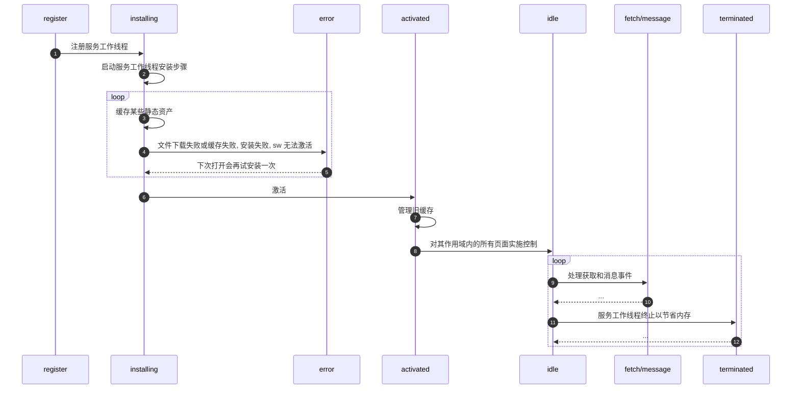

# sw

## sw 能做什么

1. 拦截和处理网络请求, 网络代理
2. 管理缓存中的响应
3. 实现离线体验
4. 推送通知
5. 后台同步
(定期同步或地理围栏)

## sw 和 webWorker 区别

1. 是 worker 的一种

## sw 使用壁垒

1. 浏览器支持
    - [x] Chrome
    - [x] Firefox
    - [x] Opera
    - [ ] Safari
2. https / localhost
3. 无法直接访问 DOM, 需要通过 postMessage 消息触达
4. 在不用时会被中止，并在下次有需要时重启, 需要持续保存并在重启后加以重用的信息，需要借助 IndexedDB。

## sw 生命周期

sw 生命周期完全独立于网页

## 参考资料

官网
<https://developers.google.com/web/fundamentals/primers/service-workers?hl=zh-cn>

Service Worker初探
<https://juejin.cn/post/6844903972759666701>

React如何通过Webpack优雅的接入serviceWorker的成熟方案workBox && Google Analytics
<https://juejin.cn/post/6844903845995216909>

angular-service-worker
<https://angular.cn/guide/service-worker-intro>

[译] JavaScript 是如何工作的：Service Worker 的生命周期与使用场景
<https://juejin.cn/post/6844903615065227278>

「读书笔记」第四版JavaScript高级程序设计（第二十七章）
<https://juejin.cn/post/6890116762415661069>
