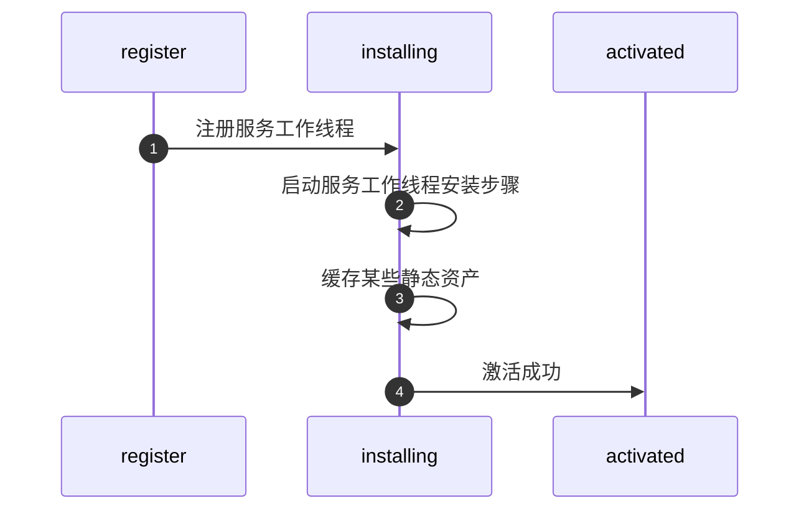
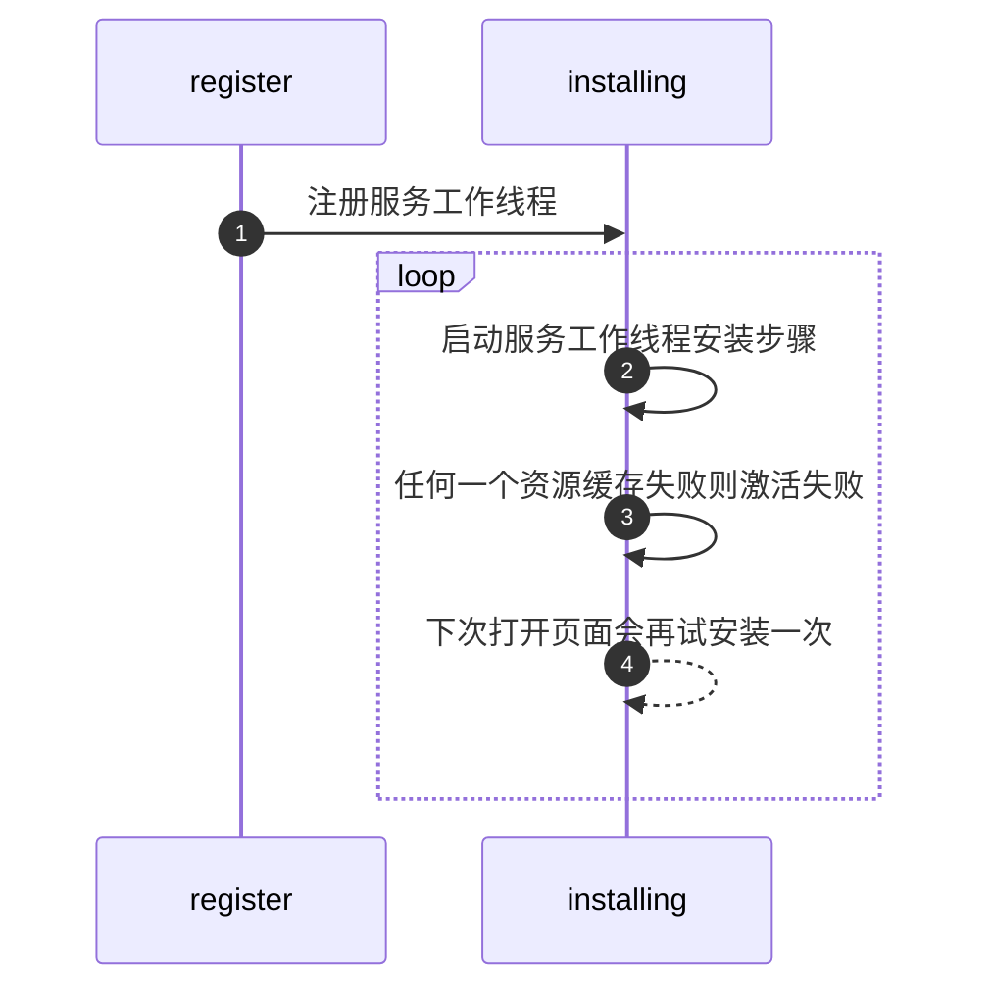
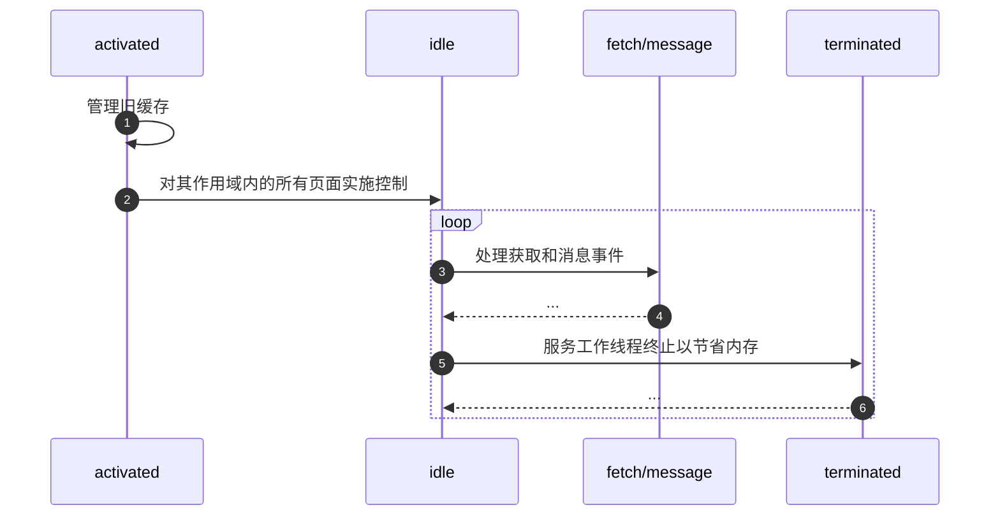
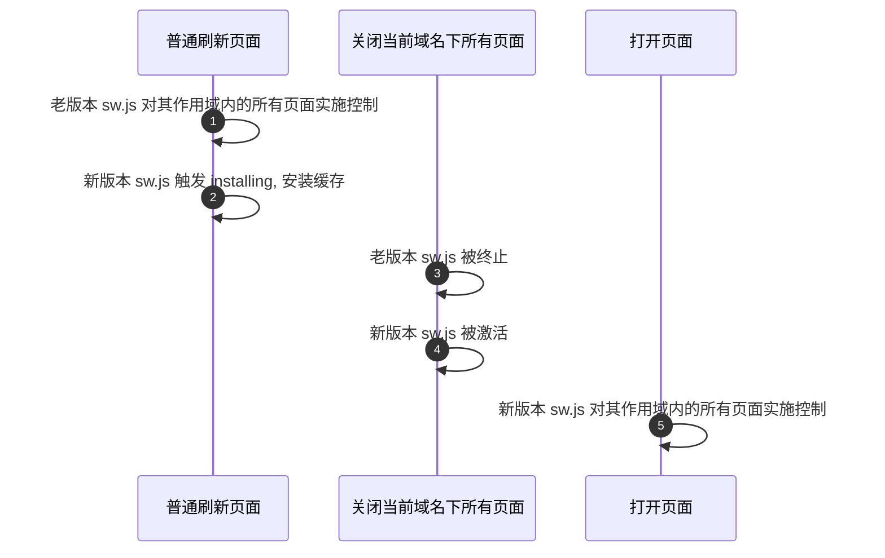
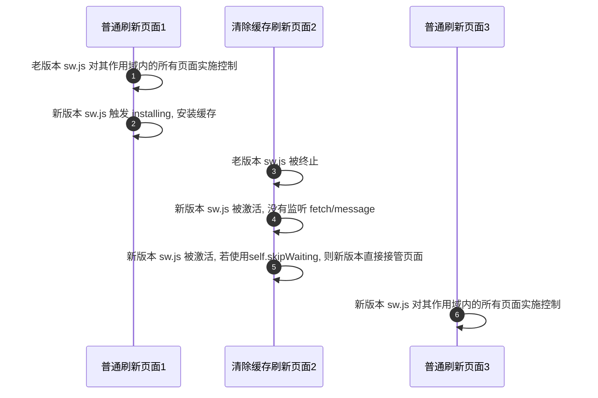
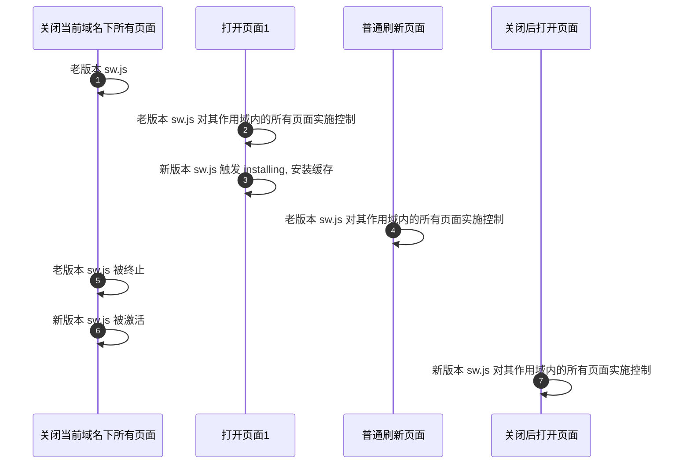
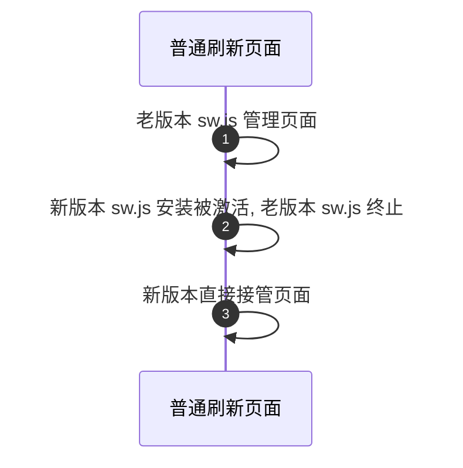
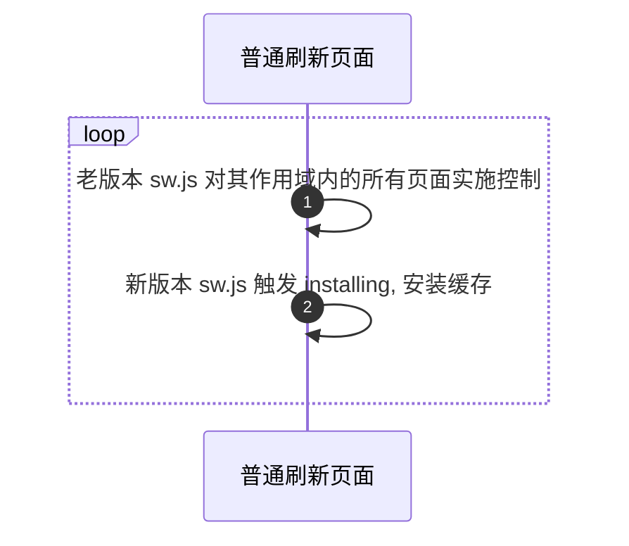
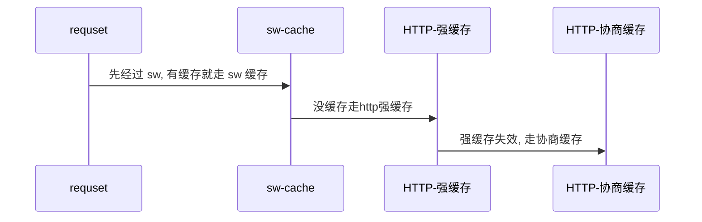

# Service Worker

* Service Worker是渐进式web应用（pwa）的核心技术。
* 注册之后，可以独立于浏览器在后台运行
* 控制我们的一个或者多个页面
* 如果我们的页面在多个窗口中打开，Service Worker不会重复创建
* 就算浏览器关闭之后，Service worker也同样运行
* 浏览器是不会允许Service Worker一直处于工作状态, 因为随着用户打开越来越多的注册了Service Worker的页面，性能肯定会有影响
* Service Worker是客户端和服务端的代理层，客户端向服务器发送的请求，都可以被Service Worker拦截，并且可以修改请求，返回响应
* 用户关闭了所有的页面，Service Worker同样可以和服务器通信。完成尚未完成的数据请求，可以确保用户的任何操作都可以发送到服务器

## Service Worker 能做什么

1. 独立工作线程, 不阻塞主线程
2. 拦截和处理网络请求, 网络代理
3. 管理缓存中的响应, 提升用户体验
4. 实现离线体验, 提供完整用户体验
5. 后台同步请求, 断网情况会将请求保护, 等有网自动发送请求给服务器, sync 事件
6. 推送通知 push

## Service Worker 使用壁垒

1. 浏览器支持
    * [x] Chrome
    * [x] Firefox
    * [x] Opera
    * [ ] Safari
2. https / localhost
3. 无法直接访问 DOM, 需要通过 postMessage 消息触达
4. 异步操作, 不支持同步操作
5. sw 更新, 通过刷新(非强刷)不能交换给新的 sw 管理 fetch, 当(当前域名下所有页面关闭重新打开 or 清缓存强刷)才交给新的 sw.js, 在这之前新的 sw 一直等待状态
6. 在不用时会被中止，并在下次有需要时重启, 需要持续保存并在重启后加以重用的信息，需要借助 IndexedDB
7. install后, 用户刷新或跳转到其他页面, 才开始监管请求, fetch 事件, 可使用 `self.clients.claim` 避开
8. cdn 资源可以被 sw.caches 缓存, 但是请求会自动优先走浏览器缓存 memory cache

## Event Api

1. install：Service Worker 安装成功后被触发的事件，在事件处理函数中可以添加需要缓存的文件
2. activate：当 Service Worker 安装完成后并进入激活状态，会触发 activate 事件。通过监听 activate 事件你可以做一些预处理，如对旧版本的更新、对无用缓存的清理等
3. message：监听其他线程的postMessage消息
4. fetch：scope下的页面发起请求时候，会触发fetch事件，可对请求做各种拦截处理
5. push：订阅了推送服务以后，该事件用来响应系统消息，并传递服务消息(即使用户已经关闭了页面)
6. sync：后台同步，在网络环境较差的情况下，可将网络请求交由后台同步处理（SyncManager API）
7. controllerchange：当获取到一个新的 active worker 时触发

## sw 全局 Api

```js
// 获取当前控制页面的活动 Service Worker
navigator.serviceWorker.controller

// 发送消息
navigator.serviceWorker.controller.postMessage({ type: xxx })

self.addEventListener('message', (event) => {
  if (event.data && event.data.type === 'SKIP_WAITING') {
    self.skipWaiting();
  }
});

self.clients.claim();
```

## Service Worker 生命周期

Service Worker 生命周期完全独立于网页


### 第一次打开页面时 Service Worker 干的活

#### 缓存成功, 这里仅做缓存, 没有接管页面请求控制

> `self.clients.claim` 方法可以让当前的Service Worker立刻掌控页面，实现页面的及时更新, 无需刷新就能接管页面



#### 缓存失败



### 刷新或再次打开页面后 Service Worker 干的活



## 更新 Service Worker

1. 修改 sw.js 文件, 浏览器(在页面关闭重新打开页面后 or 刷新后)会尝试在后台重新下载定义 Service Worker 的脚本文件, 若 Service Worker 文件与其当前所用文件存在字节差异，则将其视为新 Service Worker
2. 新 Service Worker 将会启动，且将会触发 install 事件
3. 此时，旧 Service Worker 仍控制着当前页面，因此新 Service Worker 将进入 waiting 状态
4. 当(当前域名下所有页面关闭重新打开 or 清缓存强刷)(**普通刷新不管用**)，旧 Service Worker 将会被终止，新 Service Worker 将会取得控制权。
5. 新 Service Worker 取得控制权后，将会触发其 activate 事件。

### 更新方式

* 浏览器默认的更新机制
* 使用skipWaiting方法，强制更新
* 使用 skipWaiting + reload页面（serviceWorker监听controllerchange）
* 使用skipWaiting + tips，在上一步的基础上加用户提示 用户手动reload

#### skipWaiting()和clients.claim()

* skipWaiting：更新Server Worker时候可以跳过waiting阶段，直接激活
* clients.claim：让激活后的Server Worker直接接管所有打开的页面(多个tab页)，多用于第一次注册Service Worker

### 更新成功方式 1



### 更新成功方式 2



### 更新成功方式 3



### 更新成功方式 4

```js
// self.skipWaiting方法让当前新版本的Service Worker跳过等待
self.skipWaiting()
```



### 更新失败方式 1



## Service Worker 全局对象 caches

1. 关闭浏览器, sw缓存不会失效
2. 清浏览器缓存后, sw 缓存失效
3. 和 Cookie 一样，都是具有同源策略的

### Caches Api

```js
caches.open(cacheName) => Primose<cache>
caches.keys() => Primose<cacheName[]>
cache.addAll(url[])
cache.put(url)
cache.put(e.request, responseToCache);
cache.add(key, value)
cache.delete(key)
cache.match(url | Requst) ｜ caches.match(url | Requst)
```

### sw.caches 和 http 缓存关系



### sw.caches 和 indexDB 区别

TODO: ??

### 缓存模式

* Stale While Revalidate (主要, 优先返回缓存，并发送网络请求更新本地缓存)
* Network First (次主要)
* Cache First
* Network Only
* Cache Only

#### 1. 缓存优先

```js
self.addEventListener('fetch', (event) => {
  event.respondWith(
    caches.open('cache-name').then((cache) => {
      return cache.match(event.request).then((cacheResponse) => {
        if (cacheResponse) {
            return cacheResponse;
        }
        return fetch(event.request).then((networkResponse) => {
          cache.put(event.request, networkResponse.clone())
          return networkResponse
        })
      })
    })
  )
})
```

#### 2. 缓存优先, 频繁更换资源, 在第二次加载的时候显示可用的最新版本 (高效方式)

```js
self.addEventListener('fetch', (event) => {
  event.respondWith(
    caches.open('cache-name').then((cache) => {
      return caches.match(event.request).then((cacheResponse) => {
        const fetchPromise = fetch(event.request).then((networkResponnse) => {
          cache.put(event.request, networkResponnse)
          return networkResponnse
        })
        return cacheResponse || fetchPromise
      })
    })
  )
})
```

#### 3. 网络请求优先, 请求失败走缓存

```js
self.addEventListener('fetch', (event) => {
  event.respondWith(
    caches.open('cache-name').then((cache) => {
      return fetch(event.request)
      .then((networkResponse) => {
        cache.put(event.request, networkResponse.clone())
        return networkResponse
      })
      .cache(() => {
        return cache.match(event.request)
      })
    })
  )
})
```

## Service Worker - Client 通信

1. Broadcast Channel API
    * 兼容性差, Chrome、Firefox 和 Opera 目前支持该功能
    * 能够建立多对多广播通信
    * 此 API 允许上下文之间进行通信，而无需引用
2. MessageChannel API
   * 它可用于在 Window 和 Service Worker 上下文之间建立一对一通信
3. Service Worker 的 Clients 接口
   * 它可用于向 Service Worker 的一个或多个客户端进行广播

### Broadcast Channel API

```js
// 主线程
const broadcast = new BroadcastChannel('count-channel');
broadcast.onmessage = (event) => {
    console.log(event.data.payload);
    document.getElementById("counter").innerHTML = event.data.payload;
};
broadcast.postMessage({
    type: 'INCREASE_COUNT_1'
});


// 工作线程 sw.js
let count = 0;
const broadcast = new BroadcastChannel('count-channel');
broadcast.onmessage = (event) => {
    if (event.data && event.data.type === 'INCREASE_COUNT_1') {
        console.log(count);
        broadcast.postMessage({ payload: ++count });
    }
};
```

### MessageChannel API

```js
// 主线程
const messageChannel = new MessageChannel();
navigator.serviceWorker.controller.postMessage(
    { type: "INIT_PORT" },
    [messageChannel.port2]
);
messageChannel.port1.onmessage = (event) => {
    console.log(event.data.payload);
    document.getElementById("counter").innerHTML = event.data.payload;
};
// Then we send our first message
navigator.serviceWorker.controller.postMessage({
    type: "INCREASE_COUNT",
});

// 工作线程 sw.js
let getVersionPort;
let count = 0;
self.addEventListener("message", event => {
    if (event.data && event.data.type === 'INIT_PORT') {
        getVersionPort = event.ports[0];
    }

    if (event.data && event.data.type === 'INCREASE_COUNT') {
        getVersionPort.postMessage({ payload: ++count });
    }
});
```

### client API

```js
// 主线程
navigator.serviceWorker.onmessage = (event) => {
    if (event.data && event.data.type === 'REPLY_COUNT_CLIENTS') {
        console.log(event.data.payload);
        document.getElementById("counter").innerHTML = event.data.payload;
    }
};
navigator.serviceWorker.controller.postMessage(
    { type: "INCREASE_COUNT_CLIENTS" }
);


// 工作线程 sw.js
let count = 0;
self.addEventListener('message', (event) => {
    if (event.data && event.data.type === 'INCREASE_COUNT_CLIENTS') {
        // Select who we want to respond to
        self.clients.matchAll({
            includeUncontrolled: true,
            type: 'window',
        }).then((clients) => {
            if (clients && clients.length) {
                // Send a response - the clients
                // array is ordered by last focused
                clients[0].postMessage({
                    type: 'REPLY_COUNT_CLIENTS',
                    payload: ++count,
                });
            }
        });
    }
});
```

### 后台同步

```js
// 主线程.js
registration.sync.register(`send-messages`);

// sw.js
function sendMessages() {
    return fetch('http://localhost:9999/api/test').then((response) => {
        return response.json()
    }).then((data) => {
        console.log(data.errCode === 0)
        return data.errCode === 0 ? Promise.resolve() : Promise.reject()
    })
}
self.addEventListener('sync', (event) => {
    // 拿到我们刚才发送的标识
    if (event.tag === 'send-messages') {
        event.waitUntil(
            sendMessages().catch(() => {
                // 当event.lastChance属性为true时，将会放弃尝试
                // 在chrome浏览器中测试，online 下请求失败时, 一共会发送三次，第一次到第二次的间隔为5分钟，第二次到第三次的间隔为10分钟。
                if (event.lastChance) {
                    console.log('不会再次尝试请求了')
                }
                return Promise.reject('fail');
            })
        )
    }
});
```

## PWA

* manifest
* cache Api
* serviceWorker
* push message
* server sync

## Service Worker 和 webWorker 区别

1. 是 worker 的一种

## 参考资料

官网
<https://developers.google.com/web/fundamentals/primers/service-workers?hl=zh-cn>

Service Worker初探
<https://juejin.cn/post/6844903972759666701>

React如何通过Webpack优雅的接入serviceWorker的成熟方案workBox && Google Analytics
<https://juejin.cn/post/6844903845995216909>

如何与 Service Worker 通信
<https://mp.weixin.qq.com/s/qcU8DteP68bVd2WfG4ZJAQ>

Web Worker 文献综述
<https://mp.weixin.qq.com/s/MyRRIbn-UoruVD1dpvD-QQ>

angular-service-worker
<https://angular.cn/guide/service-worker-intro>

[译] JavaScript 是如何工作的：Service Worker 的生命周期与使用场景
<https://juejin.cn/post/6844903615065227278>

「读书笔记」第四版JavaScript高级程序设计（第二十七章）
<https://juejin.cn/post/6890116762415661069>

查看 Service Worker 详情
<chrome://inspect/#service-workers>
