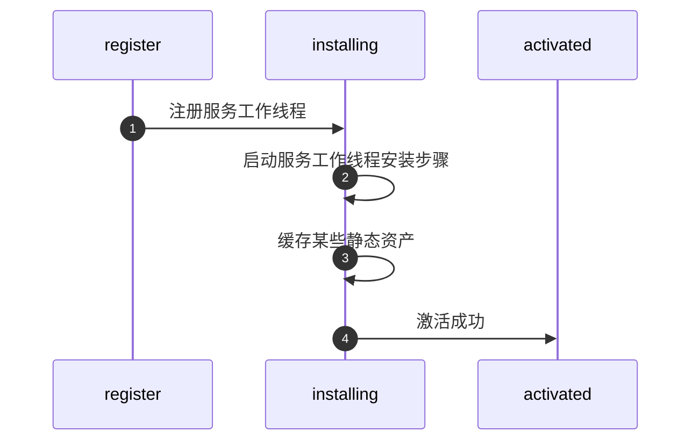
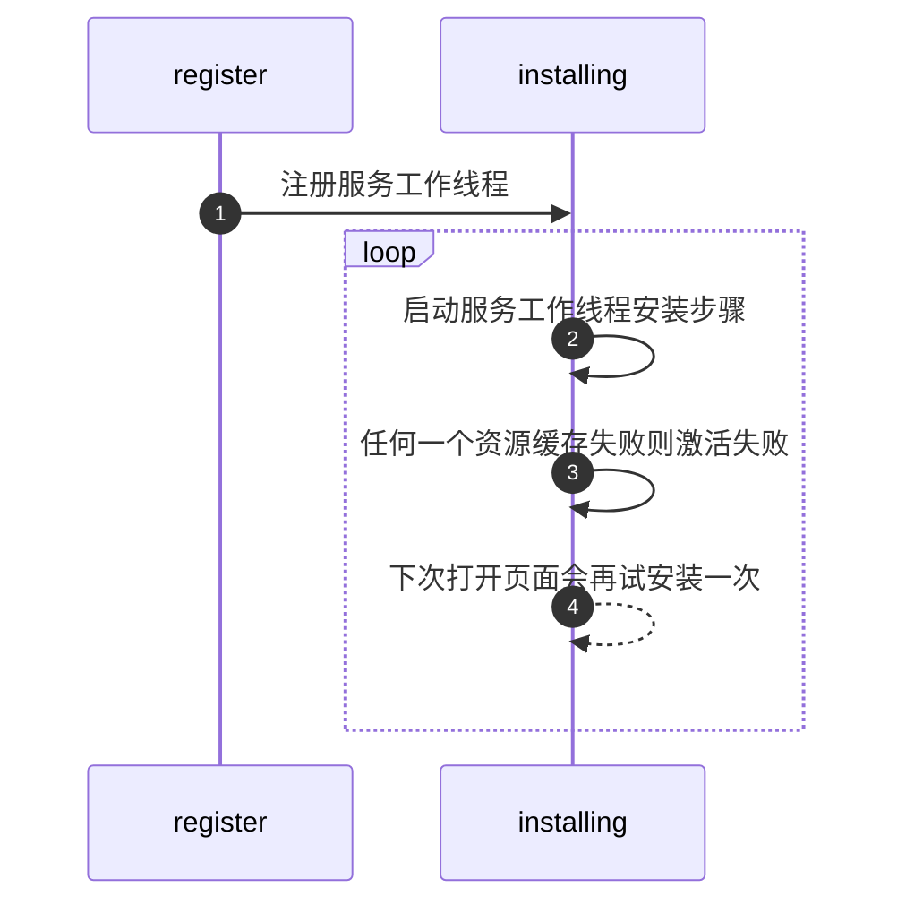
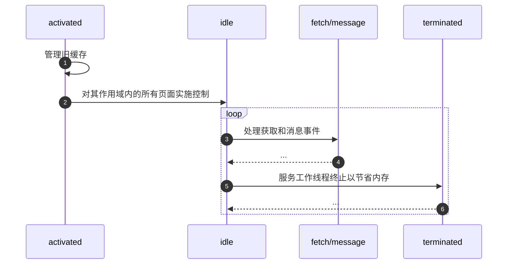

# sw

## sw 能做什么

1. 拦截和处理网络请求, 网络代理
2. 管理缓存中的响应
3. 实现离线体验
4. 推送通知
5. 后台同步
(定期同步或地理围栏)

## sw 和 webWorker 区别

1. 是 worker 的一种

## sw 全局对象 caches 和 indexDB 区别

### sw.caches

1. 关闭浏览器, sw缓存不会失效
2. 清浏览器缓存后, sw 缓存失效

### indexDB

## sw 使用壁垒

1. 浏览器支持
    - [x] Chrome
    - [x] Firefox
    - [x] Opera
    - [ ] Safari
2. https / localhost
3. 无法直接访问 DOM, 需要通过 postMessage 消息触达
4. sw 更新, 通过刷新(非强刷)不能交换给新的 sw 管理 fetch, 当(页面关闭重新打开 or 清缓存强刷)才交给新的 sw.js, 在这之前新的 sw 一直等待状态
5. 在不用时会被中止，并在下次有需要时重启, 需要持续保存并在重启后加以重用的信息，需要借助 IndexedDB
6. 避免设置 install 事件侦听器, 减少缓存失效概率
7. install后, 用户刷新或跳转到其他页面, 才开始监管请求, fetch 事件 **???**

## 更新 sw

1. 修改 sw.js 文件, 浏览器会尝试在后台重新下载定义 Service Worker 的脚本文件, 若 Service Worker 文件与其当前所用文件存在字节差异，则将其视为新 Service Worker
2. 新 Service Worker 将会启动，且将会触发 install 事件
3. 此时，旧 Service Worker 仍控制着当前页面，因此新 Service Worker 将进入 waiting 状态
4. 当(页面关闭重新打开 or 清缓存强刷)(**普通刷新不管用**)，旧 Service Worker 将会被终止，新 Service Worker 将会取得控制权。
5. 新 Service Worker 取得控制权后，将会触发其 activate 事件。

## sw 生命周期

sw 生命周期完全独立于网页

### 第一次打开页面时 sw 干的活

#### 缓存成功

#### 缓存失败

### 再次打开页面时 sw 干的活

## 参考资料

官网
<https://developers.google.com/web/fundamentals/primers/service-workers?hl=zh-cn>

Service Worker初探
<https://juejin.cn/post/6844903972759666701>

React如何通过Webpack优雅的接入serviceWorker的成熟方案workBox && Google Analytics
<https://juejin.cn/post/6844903845995216909>

angular-service-worker
<https://angular.cn/guide/service-worker-intro>

[译] JavaScript 是如何工作的：Service Worker 的生命周期与使用场景
<https://juejin.cn/post/6844903615065227278>

「读书笔记」第四版JavaScript高级程序设计（第二十七章）
<https://juejin.cn/post/6890116762415661069>

查看 Service Worker 详情
<chrome://inspect/#service-workers>
